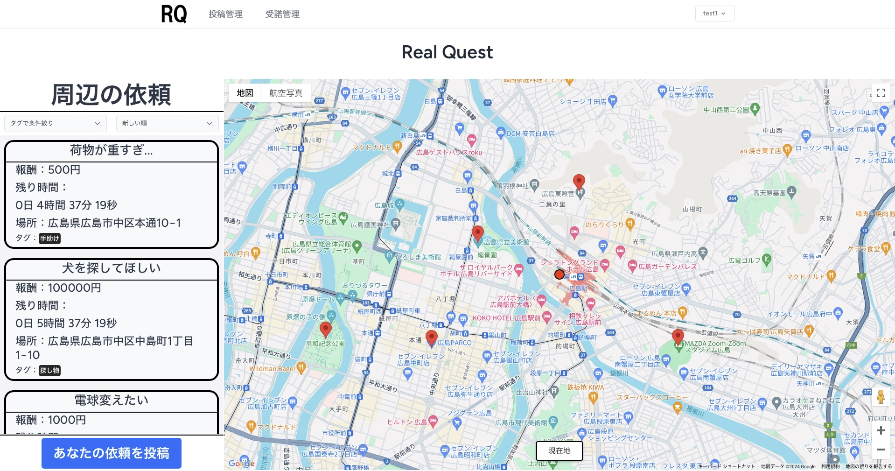

# Real Quest
### 開発目的
Real Questは、一時的なニーズに即座に対応するためのプラットフォームです。  
重い荷物を運ぶ、ちょっとした手助けが欲しいといった日常的な困りごとに対し、迅速にサポートを提供します。  
現在の市場では即応性に欠けることが多いため、このアプリではリアルタイムでニーズに応える仕組みを構築しました。

### 主な機能
直感的な地図インターフェース：地図上で現在の依頼を一目で確認でき、簡単にアクセス可能。  
カウントダウン機能：各依頼にはカウントダウンが表示され、緊急性を重視し、迅速な対応を促します。

## 簡略図



## 初回セットアップ手順（上から順番に実行）

```sh
# 作業ディレクトリに移動して作業を進めてください 

cp .env.example .env

#　以下はまとめてコピペして実行してください
docker run --rm \
    -u "$(id -u):$(id -g)" \
    -v "$(pwd):/var/www/html" \
    -w /var/www/html \
    laravelsail/php82-composer:latest \
    composer install

# 以下は一つずつ実行してください
docker-compose up -d
docker-compose exec laravel.test php artisan key:generate
docker-compose exec laravel.test php artisan migrate:fresh
docker-compose exec laravel.test npm install
docker-compose exec laravel.test npm run dev
```

ここまで実行すると http://localhost/ でサンプルアプリにアクセスできます

## 2回目以降の起動方法

```sh
docker-compose up -d
docker-compose exec laravel.test npm run dev
```

## 停止する方法は以下の通り

```sh
docker-compose stop
```

## URL
サンプルアプリ：http://localhost/

phpMyAdmin: http://localhost:8080/

## コマンドリファレンス

```sh
# MySQLコンソールにログイン
docker-compose exec mysql mysql -u sail -p'password' example_app

# キャッシュ削除
docker-compose exec laravel.test php artisan cache:clear
docker-compose exec laravel.test php artisan config:clear
docker-compose exec laravel.test php artisan route:clear
docker-compose exec laravel.test php artisan view:clear
docker-compose exec laravel.test php artisan clear-compiled

# Laravel実行コンテナにログイン
docker-compose exec laravel.test /bin/bash
```
